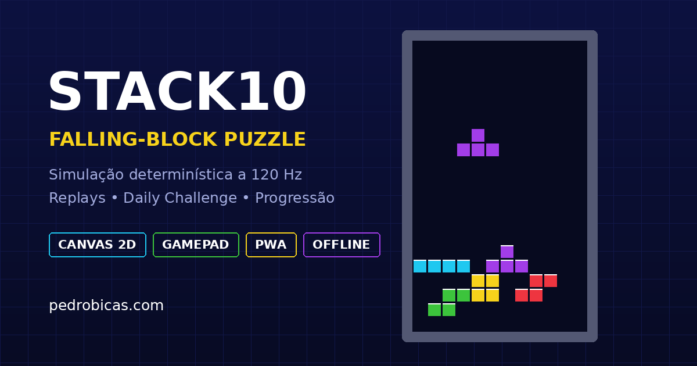

# STACK10

**Falling-block puzzle para navegador com simulação determinística, replays compactos, desafios diários e progressão local.**

[Demo ao vivo](https://stack10.pedrobicas.com) · [Portfólio](https://pedrobicas.com)



## Por que este projeto existe

STACK10 começou como um experimento de game feel no navegador e evoluiu para uma pequena game engine client-side. O foco técnico é manter a simulação independente da renderização: a partida roda em **fixed timestep de 120 Hz**, usando seed determinística e entradas registradas por tick. Essa arquitetura permite reproduzir a mesma partida sem gravar vídeo ou snapshots de estado.

## Recursos

- Maratona, Sprint 40, Blitz de 2 minutos e desafio diário.
- 7-bag randomizer determinístico.
- SRS / wall kicks, hold, ghost piece e rotação de 180°.
- T-Spins, minis, combos, back-to-back, perfect clears e finesse.
- DAS, ARR e SDF configuráveis.
- Teclado, gamepad e controles touch/gestos.
- Replay determinístico codificado em texto compartilhável.
- Recordes, splits, ranking pessoal, estatísticas vitalícias e replays dos PBs.
- XP, níveis, conquistas, streak e três missões diárias determinísticas.
- Quatro temas desbloqueáveis.
- Tema chiptune original e efeitos sintetizados com Web Audio API.
- PWA instalável e funcionamento offline após a primeira visita.
- Preferência `prefers-reduced-motion` respeitada.

## Arquitetura

```text
src/
├── core/       # peças, randomizer, simulação e replay
├── input/      # teclado e Gamepad API
├── render/     # Canvas 2D e efeitos
├── audio/      # Web Audio API
├── theme/      # skins e paletas
├── ui/         # aplicação, persistência e progressão
├── pwa/        # registro e instalação
└── styles/     # interface e responsividade
```

### Replay determinístico

O replay não armazena frames. Ele guarda:

1. versão do formato;
2. modo;
3. seed;
4. DAS/ARR/SDF;
5. quantidade de ticks;
6. eventos de input como deltas de tick.

Ao reproduzir, a engine recria a sequência de peças e aplica exatamente as mesmas entradas nos mesmos passos da simulação.

## Rodando localmente

Requer Node.js 20 ou superior.

```bash
npm install
npm run dev
```

Build de produção:

```bash
npm run build
npm run preview
```

## Qualidade

```bash
npm run lint
npm test
npm run build
npm run format:check

# tudo de uma vez
npm run verify
```

A pipeline de CI executa a mesma verificação em pushes e pull requests.

## Deploy

O projeto é estático. O diretório gerado por `npm run build` é `dist/` e pode ser publicado na Vercel, Netlify, Cloudflare Pages, GitHub Pages ou qualquer servidor de arquivos estáticos.

A configuração atual assume `https://stack10.pedrobicas.com` para canonical/Open Graph. Se usar outro domínio, altere as URLs em `index.html`.

## Controles padrão

| Ação | Tecla |
| --- | --- |
| Mover | `←` `→` |
| Soft drop | `↓` |
| Hard drop | `Espaço` |
| Girar horário | `↑` / `X` |
| Girar anti-horário | `Z` |
| Girar 180° | `A` |
| Hold | `C` / `Shift` |
| Pausa | `P` / `Esc` |
| Recomeçar | `R` |

Todas as teclas podem ser remapeadas dentro do jogo.

## Privacidade

O jogo não exige conta e não envia progresso para um backend. Preferências, recordes, conquistas e estatísticas ficam no `localStorage` do navegador.

## Licença

Código sob licença MIT. STACK10 é um projeto independente e não é afiliado à The Tetris Company.
